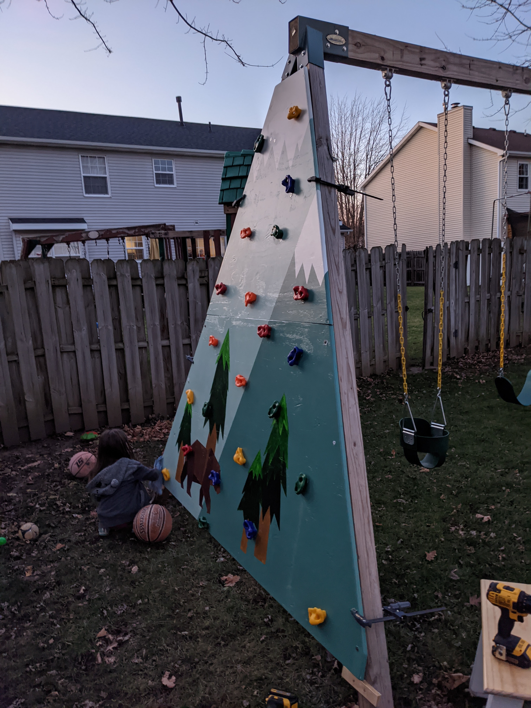
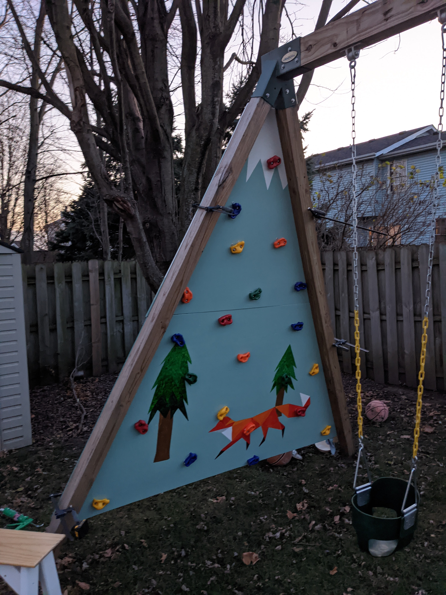

# Climbing Wall

## Installing Holds

I wanted holds on either side of the plywood so I needed to care about how I installed the holds. I started by using existing hardware - this was a mistake. I corrected myself on the bottom half of the climbing wall.

Parts:
* galvenized 1/4" x 2 1/4" bolts
* galvenized 1/4" nut
* caulking
* drill bit slightly larger than 1/4" diameter

Steps:
* Mark and drill holes that match the climbing-hold holes.  My hardware holes were setup exactly the same, regardless of the hold.
* Apply caulking to each side of the plywood to seal the holes.  
    * You may not have to do this if it doesn't rain much I suppose
* I used carriage bolts for some dumb reason - it worked, but I'd use 1/4" hex bolts next time.  
    * 2 1/4" would have been perfect. 2 1/2" was too long and 2" was a bit short for my liking.
* Putting bolts through hold and plywood, add a hold to the other side and tighten down the nut